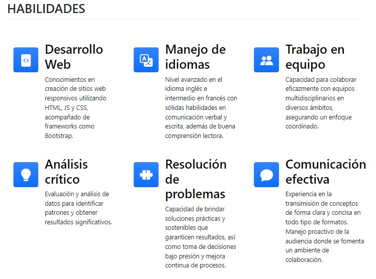
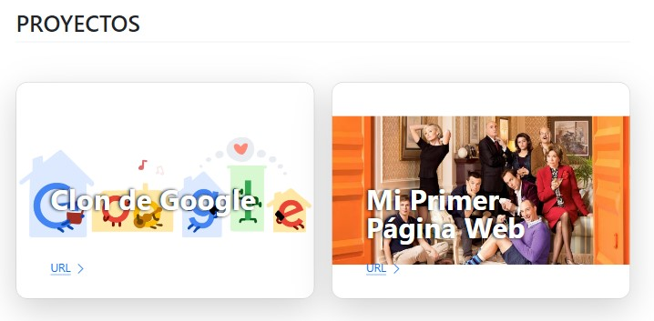
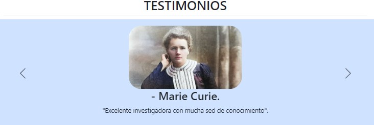
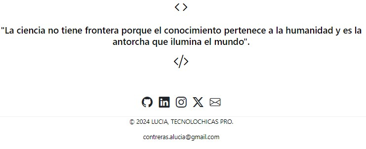

# Mi portafolio de habilidades TECNOLOCHICAS PRO 💜.

El presente proyecyo es un portafolio para poner en práctica las habilidades obtenidas dentro del bootcamp de desarrollo fronted de Tecnolochicas Pro.

Fue desarrollado con HTML, CSS y JS con el uso del framework de UI, Boostrap, utilizando además bibliotecas externas.

La página es responsiva (adaptable a diferentes tamaños de pantalla) e incluye la presentación de la autora del proyecto.

#### 🌟Proyecto desplegado: https://lucialira.netlify.app/

### SECCIONES DE MI SITIO

### TECNOLOGIAS

* HTML
* CSS
* Bootstrap
* Javascript

---

Desarrolado con 💜 por [Lucia Contreras](https://www.instagram.com/lucialiraaa/) en [TECNOLOCHICAS PRO.](https://tecnolochicas.mx/)
